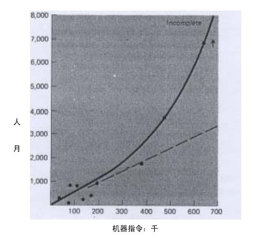
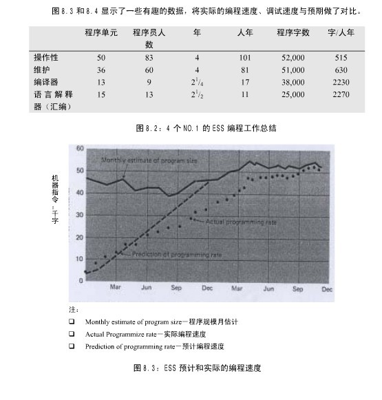

# 第 8 章 胸有成竹（Calling the Shot）

实践是最好的老师。

——PUBILIUS

实践是最好的老师，但是，如果不能从中学习，再多的实践也没有用。

——《可怜的理查年鉴》

Practice is the best of all instructors.

——PUBILIUS

Experience is a dear teacher, but fools will learn at no other.

——POOR RICHARD'S ALMANAC

系统编程需要花费多长的时间？需要多少的工作量？如何进行估计？

先前，我推荐了用于计划进度、编码、构件测试和系统测试的比率。首先，需要指出的是，仅仅通过对编码部分的估计，然后应用上述比率，是无法得到对整个任务的估计的。编码大约只占了问题的六分之一左右，编码估计或者比率的错误可能会导致不合理的荒谬结果。

第二，必须声明的是，构建独立小型程序的数据不适用于编程系统产品。对规模平均为 3200 指令的程序，如 Sackman、Erikson 和 Grant 的报告中所述，大约单个的程序员所需要的编码和调试时间为 178 个小时，由此可以外推得到每年 35,800 语句的生产率。而规模只有一半的程序花费时间大约仅为前者的四分之一，相应推断出的生产率几乎是每年 80,000 代码行。计划、编制文档、测试、系统集成和培训的时间必须被考虑在内。因此，上述小型项目数据的外推是没有意义的。就好像把 100 码短跑记录外推，得出人类可以在 3 分钟之内跑完 1 英里的结论一样。

在将上述观点抛开之前，尽管不是为了进行严格的比较，我们仍然可以留意到一些事情。即使在不考虑相互交流沟通，开发人员仅仅回顾自己以前工作的情况下，这些数字仍然显示出工作量是规模的幂函数。

图 8.1 讲述了这个悲惨的故事。它阐述了 Nanus 和 Farr2 在 System Development Corporation 公司所做研究，结果表明该指数为 1.5，即，

工作量 ＝ （常数）×（指令的数量）1.5

(电子书制作者注释:（指令的数量）1.5 的 1.5 是立方 因为软件原因无法做出这个效果来 同理 Farr2 的 2 也在右上角)

Weinwurm 的 SDC 研究报告同样显示出指数接近于 1.5。

现在已经有了一些关于编程人员生产率的研究，提出了很多估计的技术。 Morin 对所发布的数据进行了一些调查研究。这里仅仅给出了若干特别突出的条目。

注释: incomplete－未终结的

## Portman 的数据

曼彻斯特 Computer Equipment Organization（Northwest）的 ICL 软件部门的经理 Charles Portman，提出了另一种有用的个人观点。

他发现他的编程队伍落后进度大约 1/2，每项工作花费的时间大约是估计的两倍。这些估计通常是非常仔细的，由很多富有经验的团队完成。他们对 PERT 图上数百个子任务估算过（用人小时作单位）。当偏移出现时，他要求他们仔细地保存所使用时间的日志。日志显示事实上他的团队仅用了百分之五十的工作周，来进行实际的编程和调试，估算上的失误完全可以由该情况来解释。其余的时间包括机器的当机时间、高优先级的无关琐碎工作、会议、文字工作、公司业务、疾病、事假等等。简言之，项目估算对每个人年的技术工作时间数量做出了不现实的假设。我个人的经验也在相当程度上证实了他的结论。

## Aron 的数据

Joel Aron，IBM 在马里兰州盖兹堡的系统技术主管，在他所工作过的 9 个大型项目（简要地说，大型意味着程序员的数目超过 25 人，将近 30,000 行的指令）的基础上，对程序员的生产率进行了研究。他根据程序员（和系统部分）之间的交互划分这些系统，得到了如下的生产率：

- 非常少的交互 10,000 指令每人年
- 少量的交互 5,000
- 较多的交互 1,500

该人年数据未包括支持和系统测试活动，仅仅是设计和编程。当这些数据采用除以 2，以包括系统测试的活动时，它们与 Harr 的数据非常的接近。

## Harr 的数据

John Harr，Bell 电话实验室电子交换系统领域的编程经理，在 1969 年春季联合计算机会议 8 的论文中，汇报了他和其他人的经验。这些数据如图 8.2、8.3 和 8.4 所示。

这些图中，图 8.2 是最数据详细和最有用的。头两个任务是基本的控制程序，后两个是基本的语言翻译。生产率以经调试的指令/人年来表达。它包括了编程、构件测试和系统测试。没有包括计划、硬件机器支持、文书工作等类似活动的工作量。

生产率同样地被划分为两个类别，控制程序的生产率大约是 600 指令每人年，语言翻译大约是 2200 指令每人年。注意所有的四个程序都具有类似的规模——差异在于工作组的大小、时间的长短和模块的个数。那么，哪一个是原因，哪一个是结果呢？是否因为控制程

序更加复杂,所以需要更多的人员？或者因为它们被分派了过多的人员，所以要求有更多的模块？是因为复杂程度非常高，还是分配较多的人员，导致花费了更长的时间？没有人可以确定。控制程序确实更加复杂。除开这些不确定性，数据反映了实际的生产率——描述了在现在的编程技术下，大型系统开发的状况。因此，Harr 数据的确是真正的贡献。

图 8.3 和 8.4 显示了一些有趣的数据，将实际的编程速度、调试速度与预期做了对比。

## OS/360 的数据

IBM OS/360 的经验，尽管没有 Harr 那么详细的数据，但还是证实了那些结论。就控制程序组的经验而言，生产率的范围大约是 600 ～ 800（经过调试的指令）/人年。语言翻译小组所达到的生产率是 2000 ～ 3000（经过调试的指令）/人年。这包括了小组的计划、代码构件测试、系统测试和一些支持性活动。就我的观点来说，它们同 Harr 的数据是可比的。

Aron、Harr 和 OS/360 的数据都证实，生产率会根据任务本身复杂度和困难程度表现出显著差异。在复杂程度估计这片"沼泽"上的指导原则是：编译器的复杂度是批处理程序的三倍，操作系统复杂度是编译器的三倍。

## Corbato 的数据

Harr 和 OS/360 的数据都是关于汇编语言编程的，好像使用高级语言系统编程的数据公布得很少。Corbato 的 MIT 项目 MAC 报告表示在 MULTICS 系统上，平均生产率是 1200 行经调试的 PL/I 语句（大约在 1 和 2 百万指令之间）/人年。

该数字非常令人兴奋。如同其他的项目，MULTICS 包括了控制程序和语言翻译程序。和文本框: 机器指令：千字

其他项目一样，它产出的是经过测试和文档化的系统编程产品。在所包括的工作类型方面，数据看上去是可以比较的。该数字是其他项目中控制程序和翻译器程序生产率的良好平均值。

但 Corbato 的数字是行/人年，不是指令！系统中的每个语句对应于手写代码的 3 至 5 个指令！这意味着两个重要的结论。

- 对常用编程语句而言。生产率似乎是固定的。这个固定的生产率包括了编程中需要注释，并可能存在错误的情况.
- 使用适当的高级语言，编程的生产率可以提高 5 倍。
