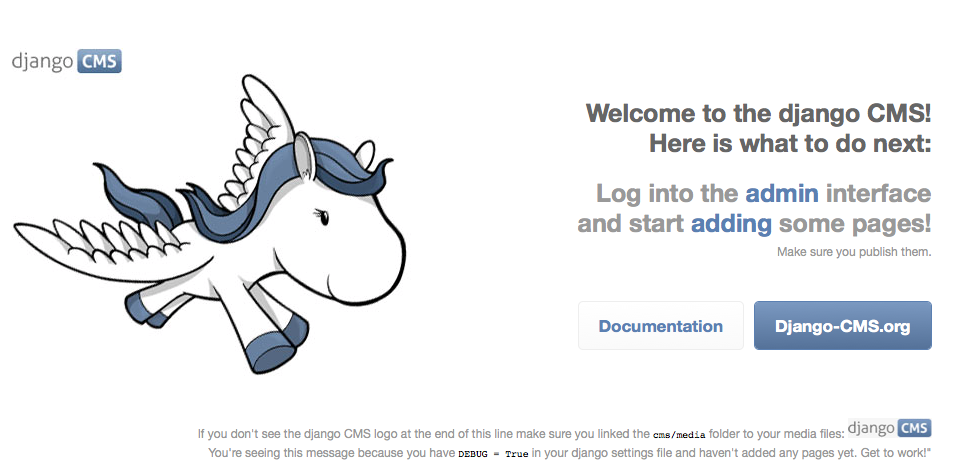
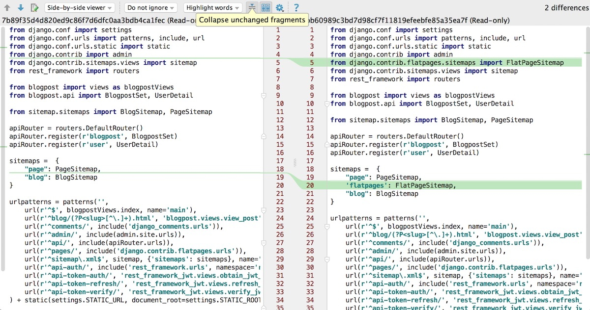
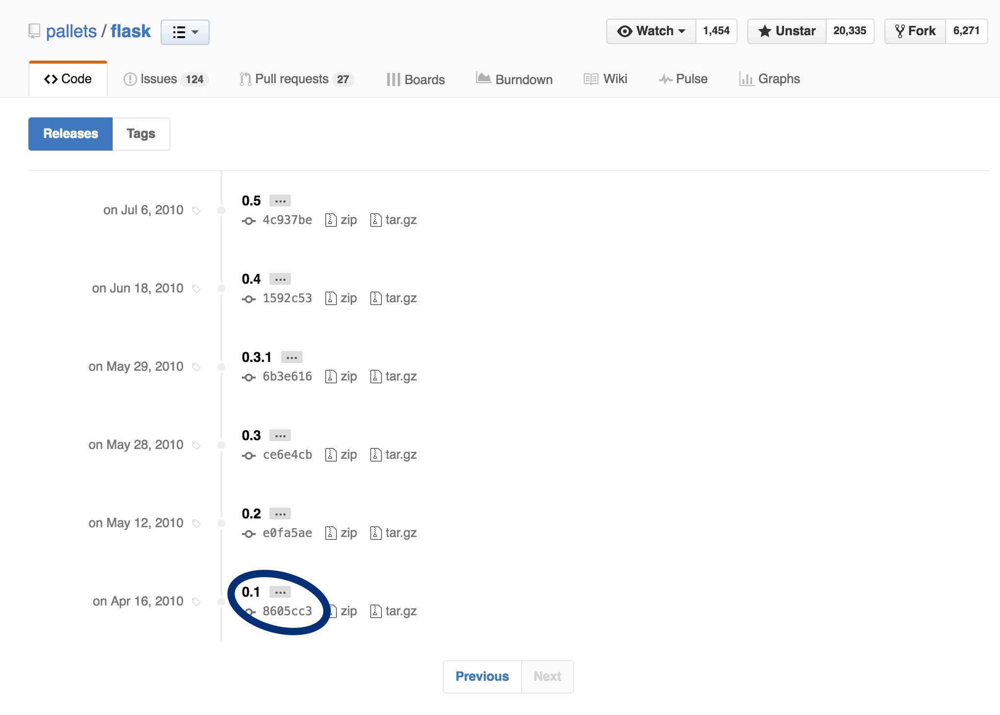
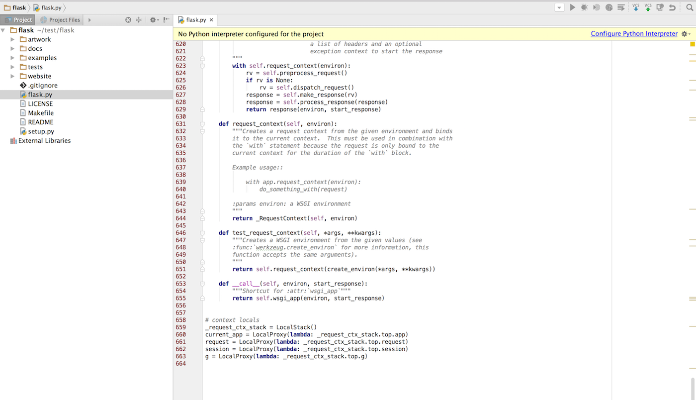

如何以“正确的姿势”阅读开源软件代码
===

> 所有让你直接看最新源码的文章都是在扯淡，你应该从“某个版本”开始阅读代码。

我们并不建议所有的读者都直接看最新的代码，正确的姿势应该是：

- clone 某个项目的代码到本地
- 查看这个项目的 release 列表
- 找到一个看得懂的 release 版本，如 1.0 或者更早的版本
- 读懂上一个版本的代码
- 向后阅读大版本的源码
- 读最新的源码

最好的在这个过程中，**可以自己造轮子来实现一遍**。 

## 阅读过程

在我阅读的前端库、Python 后台库的过程中，我们都是以造轮子为目的展开的。所以在最开始的时候，我需要一个可以工作，并且拥有我想要的功能的版本。

紧接着，我就可以开始去实践这个版本中的一些功能，并理解他们是怎么工作的。再用 `git` 大法展开之前修改的内容，可以使用 IDE 自带的 Diff 工具：

或者类似于 `SourceTree` 这样的工具，来查看修改的内容。

在我们理解了基本的核心功能后，我们就可以向后查看大、中版本的更新内容了。

开始之前，我们希望大家对版本号管理有一些基本的认识。
## 版本号管理

我最早阅读的开源软件是 Linux，而下面则是 Linux 的 Release 过程：

表格源自一本书叫《Linux内核0.11(0.95)完全注释》，简单地再介绍一下：

- 版本 0.00 是一个 hello, world 程序
- 版本 0.01 包含了可以工作的代码
- 版本 0.11 是基本可以正常的版本

这里就要扯到《GNU 风格的版本号管理策略》：

1. 项目初版本时，版本号可以为 0.1 或 0.1.0, 也可以为 1.0 或 1.0.0，如果你为人很低调，我想你会选择那个主版本号为 0 的方式；
2. 当项目在进行了局部修改或 bug 修正时，主版本号和子版本号都不变，修正版本号加 1；
3. 当项目在原有的基础上增加了部分功能时，主版本号不变，子版本号加 1，修正版本号复位为 0，因而可以被忽略掉；
4. 当项目在进行了重大修改或局部修正累积较多，而导致项目整体发生全局变化时，主版本号加 1；
5. 另外，编译版本号一般是编译器在编译过程中自动生成的，我们只定义其格式，并不进行人为控制。

因此，我们可以得到几个简单的结论：

- 我们需要阅读最早的有核心代码的版本
- 我们需要阅读 1.0 版本的 Release
- 往后每一次大的 Release 我们都需要了解一下

## 示例

以 Flask 为例：

一、先 Clone 它。

二、从 Release 页面找到它的早期版本：

三、 从上面拿到它的提交号 `8605cc3`，然后 checkout 到这次提交，查看功能。在这个版本里，一共有六百多行代码

还是有点长

四、我们可以找到它的最早版本：

然后查看它的 `flask.py` 文件，只有简单的三百多行，并且还包含一系列注释：

五、接着，再回过头去阅读

- 0.1 版本
- 。。。
- 最新的 0.10.1 版本
